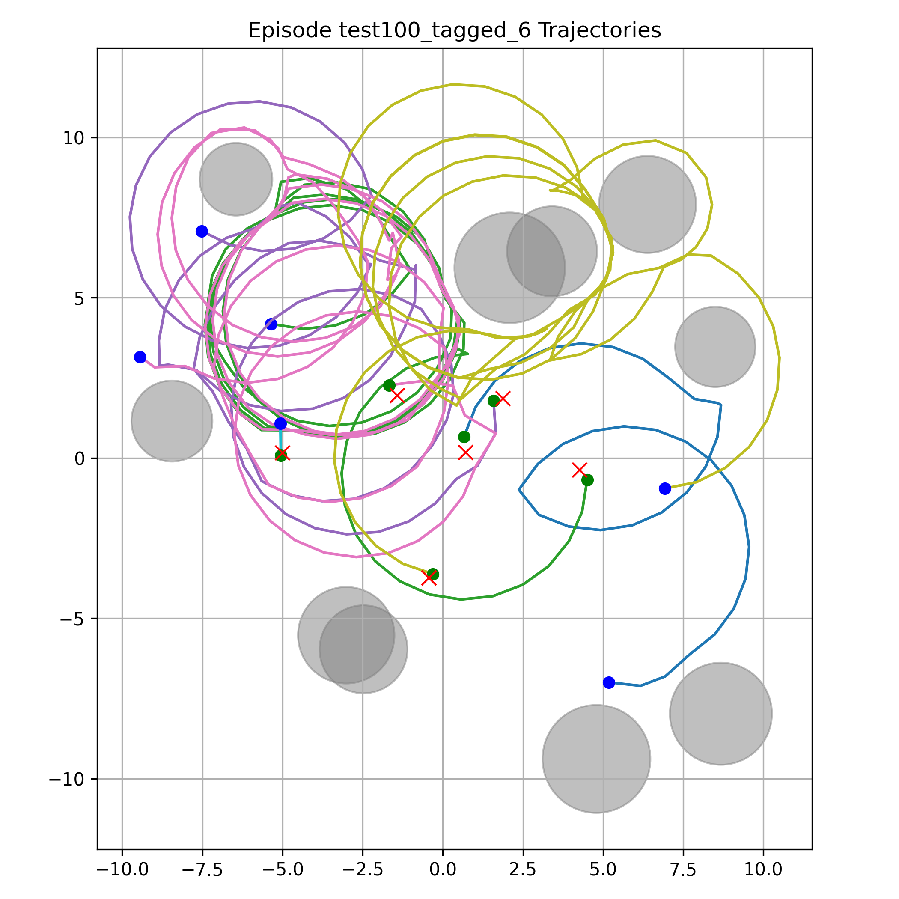
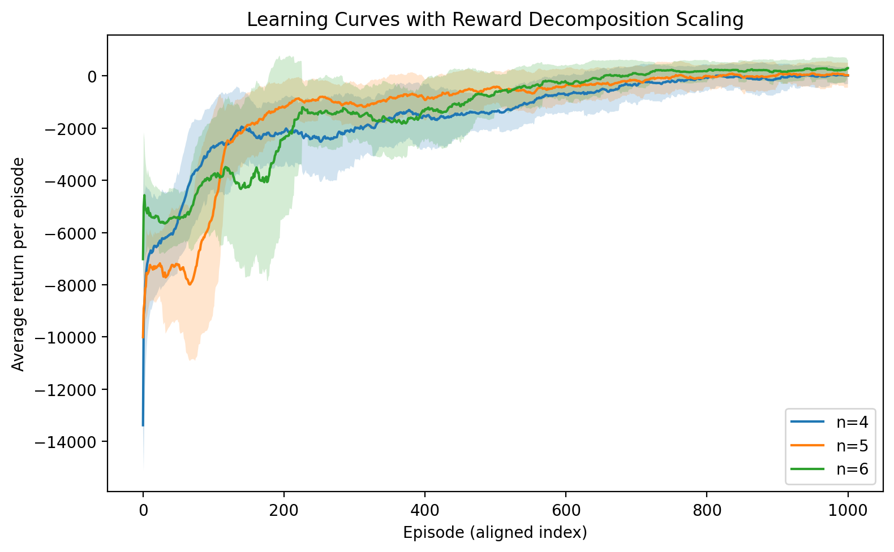

# Decentralized Shared Actor–Critic Learning for Multi-Robot Coverage

[](https://creativecommons.org/licenses/by-nc/4.0/)
[](https://doi.org/10.3390/robotics15070119)

Research codebase for **cooperative coverage of landmarks by small teams of
differential-drive robots** using multi-agent reinforcement learning. A
**decentralized shared actor–critic** framework trains a single actor and a
single critic — reused across all agents — against a custom
[PettingZoo](https://pettingzoo.farama.org/) `ParallelEnv` in continuous 2D
simulation. Agents use **permutation-invariant local observations** and
**continuous differential-drive control**, and the reward is shaped by a stepwise
**Hungarian assignment** between agents and landmarks, together with collision
penalties and time-efficiency terms. Several MADDPG / IDDPG variants are provided
for comparison. Homogeneous teams of **four, five, and six** agents are evaluated
over multiple independent seeds.

This repository accompanies the paper:

> **Kyzyrkanov, A.E.; Yedilkhan, D.; Amirgaliyeva, S.; Narynov, S.**
> *Decentralized Shared Actor–Critic Learning for Collision-Aware Small-Team
> Multi-Robot Coverage.* **Robotics** 2026, 15(7), 119.
> https://doi.org/10.3390/robotics15070119

<p align="center">
  
  
</p>

<p align="center">
  <em>Left: learned trajectories of a six-robot team covering assigned landmarks
  (red ×); grey discs are obstacles, from the obstacle-based experiments of the
  prior JRC paper. Right: training convergence (average return per episode) across
  team sizes n = 4, 5, 6 with the per-seed spread shaded.</em>
</p>

---

## Overview

- **Environment** — a pure-tensor, CUDA-accelerated PettingZoo `ParallelEnv` for
  differential-drive robots. Continuous `(dv_lin, dv_ang)` actions; the reward is
  a 9-component shaped vector per agent, combining progress toward an assigned
  landmark, global Hungarian coverage, goal-reaching bonuses, agent–agent and
  obstacle collision penalties, and velocity/time shaping.
- **Algorithms** — an abstract `MADDPGBase` plus several concrete variants that
  all share a single actor and a single critic network; they differ only in what
  is fed to the critic and how per-agent losses are aggregated:
  - `MADDPGSharedActorCritic` — joint-action centralized critic (CTDE).
  - `MADDPGSharedActorCriticIndependent` / `...IndependentQmean` — per-agent
    actor-loss aggregation variants.
  - `IDDPG` — critic over `(state, single-agent action)`.
  - `IDDPGWithoutS` — fully independent critic over `(obs_i, action_i)`.
- **Models** — `SimpleActor`, `SharedCritic`, `MultiheadCritic`.
- **Replay** — a tagged replay buffer that reserves capacity for rare
  goal-reaching transitions to stabilize learning, plus an optional offline
  replay augmentation.

## Repository layout

| Path | Contents |
|---|---|
| `custom_envs/diff_driven/` | Differential-drive PettingZoo environments |
| `rl/maddpg.py` | `MADDPGBase` and all algorithm variants |
| `models/` | Actor and critic networks |
| `config.py` | Global default hyperparameters and device registry |
| `run/` | Training / evaluation entry points and launch scripts |
| `tools/` | Log export and results-notebook generation |
| `res/` | Analysis notebooks and generated result figures |
| `webots_world/` | Webots world files for simulation |

## Installation

Requires Python 3.10–3.12 and a CUDA-capable GPU (the environment and algorithms
run on GPU by default). PyTorch must be installed for your CUDA version.

```bash
git clone https://github.com/qyzyrqanov/dif_driven_maddpg.git
cd dif_driven_maddpg
python -m venv .venv
source .venv/bin/activate            # Windows: .venv\Scripts\activate
pip install -r requirements.txt
```

## Usage

The project root must be on `PYTHONPATH` (the code uses absolute package imports
like `from custom_envs.diff_driven... import ...`). Training scripts write all
artifacts (checkpoints, replay buffers, plots, logs, CSVs) to the **current
working directory** using bare filenames — so run each script from the directory
where you want its outputs.

```bash
source .venv/bin/activate
export PYTHONPATH=$(pwd)
python run/train_done4.py            # or any other run/train_*.py
```

Restarting a script from the same directory resumes automatically from the last
saved episode. Validate a run by inspecting the generated
`learning_curve_episode_*.png`, `actor_loss_episode_*.png`,
`critic_loss_episode_*.png`, `trajectory_episode_*.png`, and `episode_log.txt`.

There are no automated tests, lint, or build steps; validation is by inspecting
these training artifacts.

## Reproducing the papers

**Primary paper — *Decentralized Shared Actor–Critic Learning* (Robotics 2026).**
This paper covers the core contribution of the repository: a single **shared**
actor and **shared** critic trained across all agents for **collision-aware
coverage by small teams** (n = 4, 5, 6), with Hungarian-assignment reward shaping
and the per-agent done / landmark-coverage mechanics of `DiffDriveParallelEnvDone`.
The `run/train_done*.py` scripts (and their `run/run_train_done*` launchers) are
the entry points for these coverage experiments.

**Prior paper — *Adaptive Replay Strategies* (JRC 2025).** This paper focused on
**adaptive replay** — the offline replay augmentation and the tagged replay
buffer — for a team of **6 differential-drive drones with obstacles**. It uses the
`MADDPGSharedActorCriticIndependentQmean` algorithm and is reproduced with:

| Purpose | Script |
|---|---|
| Main runs (offline replay + tagged replay buffer) | `run/train_done350.py` |
| Ablation runs | `run/train_done350_ablation*.py` |
| Baseline runs | `run/train_done350_base*.py` |

Each of these iterates over seeds, writing per-seed outputs into numbered
subdirectories of the current working directory.

## Citation

If you use this code or build on this work, please cite the primary paper. If you
use the adaptive-replay training strategies, please also cite the prior paper
that this code was originally developed for.

### Primary paper (this repository)

**URL:** https://doi.org/10.3390/robotics15070119

**APA:**

> Kyzyrkanov, A. E., Yedilkhan, D., Amirgaliyeva, S., & Narynov, S. (2026).
> Decentralized Shared Actor–Critic Learning for Collision-Aware Small-Team
> Multi-Robot Coverage. *Robotics, 15*(7), 119. https://doi.org/10.3390/robotics15070119

**BibTeX:**

```bibtex
@article{robotics15070119,
  author  = {Kyzyrkanov, Abzal E. and Yedilkhan, Didar and Amirgaliyeva, Saltanat and Narynov, Sergazy},
  title   = {Decentralized Shared Actor–Critic Learning for Collision-Aware Small-Team Multi-Robot Coverage},
  journal = {Robotics},
  year    = {2026},
  volume  = {15},
  number  = {7},
  pages   = {119},
  doi     = {10.3390/robotics15070119}
}
```

### Prior work using this code

**URL:** https://doi.org/10.18196/jrc.v6i6.28387

**APA:**

> Kyzyrkanov, A., Otarbay, Z., Yedilkhan, D., & Amirgaliyev, B. (2025). Adaptive
> replay strategies stabilize multi-agent reinforcement learning for
> differential-drive robot coordination. *Journal of Robotics and Control (JRC),
> 6*(6), 3068–3087. https://doi.org/10.18196/jrc.v6i6.28387

**BibTeX:**

```bibtex
@article{Kyzyrkanov2025JRCReplay,
  author  = {Kyzyrkanov, Abzal and Otarbay, Zhenis and Yedilkhan, Didar and Amirgaliyev, Beibut},
  title   = {Adaptive Replay Strategies Stabilize Multi-Agent Reinforcement Learning for Differential-Drive Robot Coordination},
  journal = {Journal of Robotics and Control (JRC)},
  year    = {2025},
  volume  = {6},
  number  = {6},
  pages   = {3068--3087},
  doi     = {10.18196/jrc.v6i6.28387}
}
```

## License

This work is licensed under the **Creative Commons
Attribution-NonCommercial 4.0 International License (CC BY-NC 4.0)**.

You are free to use, share, and adapt the material for **non-commercial**
purposes, provided you give appropriate credit by **citing the publications
above**. **Commercial use requires separate written permission** from the
copyright holder. See [`LICENSE`](./LICENSE) for the full terms.

© 2026 Abzal E. Kyzyrkanov. Contact: abzzall@gmail.com
